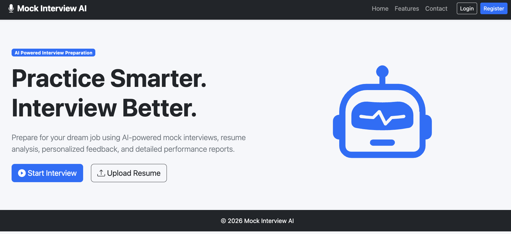
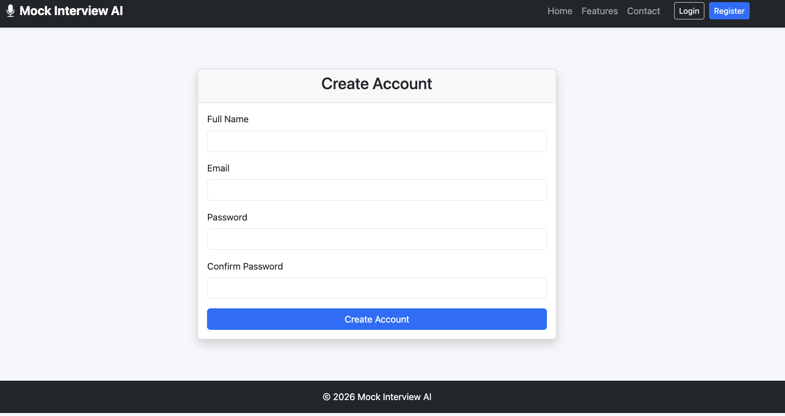
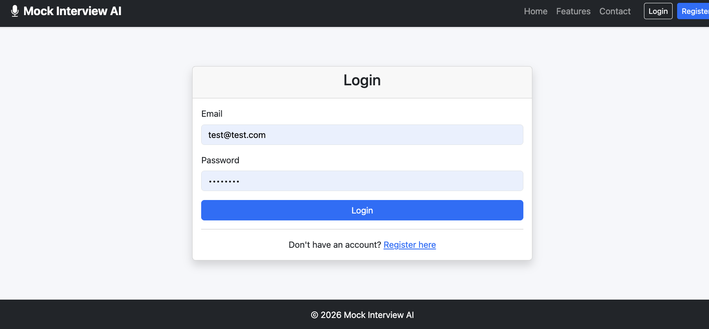
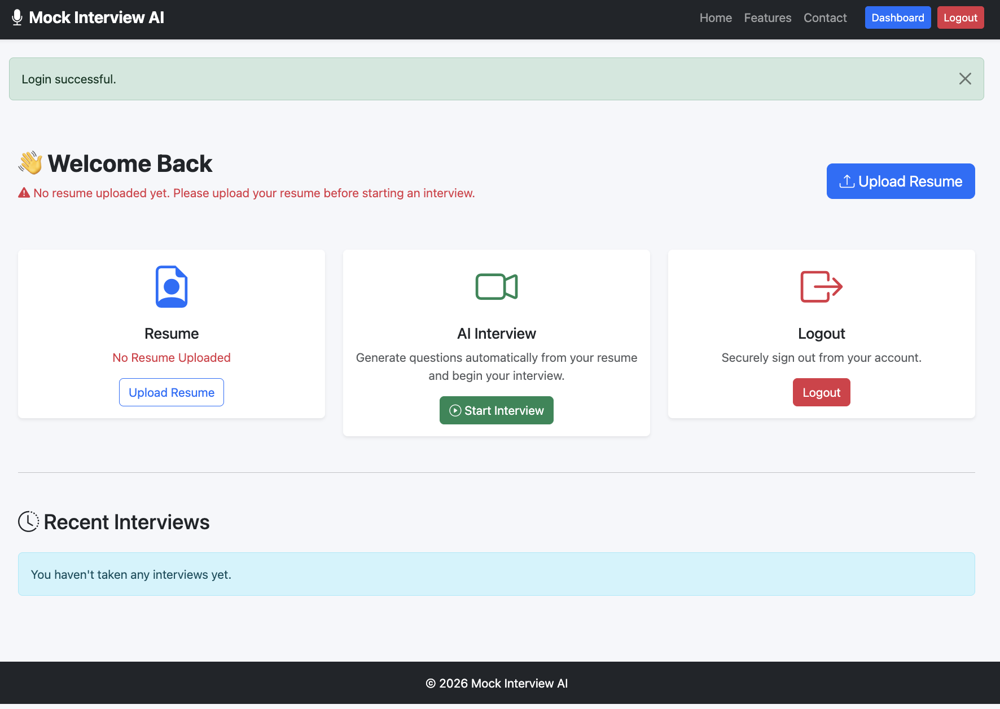
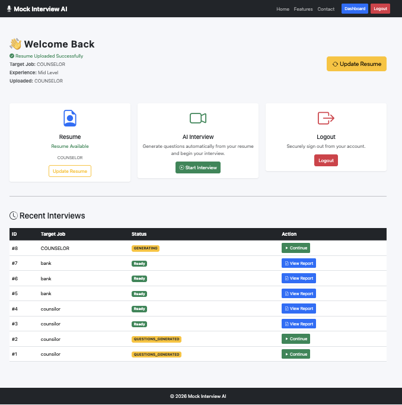
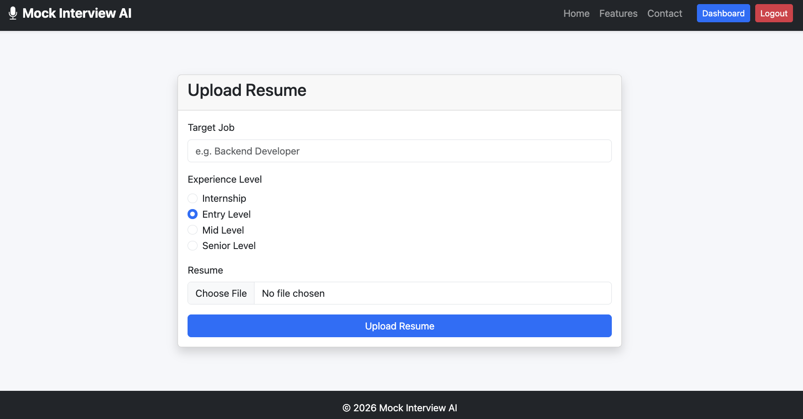
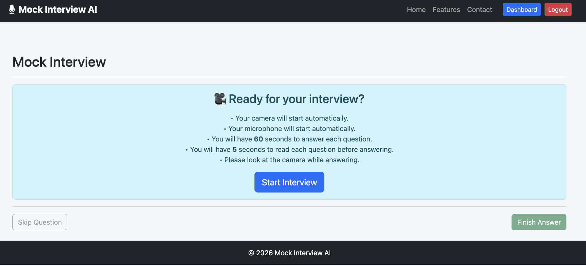
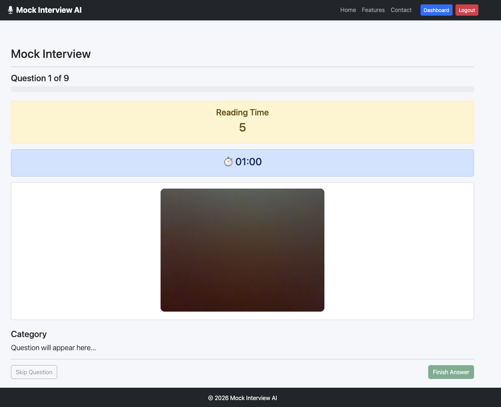
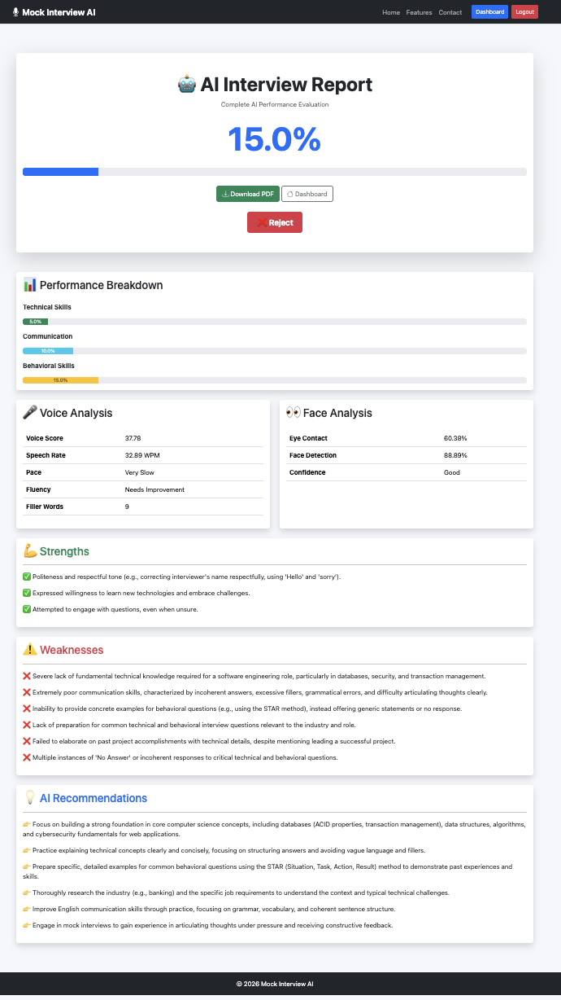
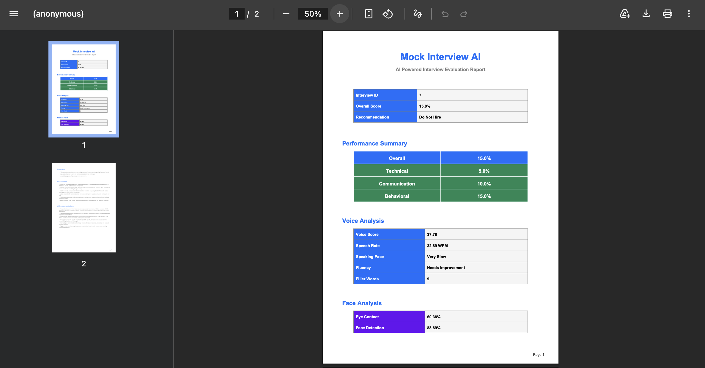

# 🤖 Mock Interview AI

> An AI-powered mock interview platform that analyzes resumes, generates personalized interview questions, evaluates candidate responses, analyzes speech and facial behavior, and produces professional interview reports.


---

# 📖 Overview

Mock Interview AI is a Flask-based web application that simulates a real technical interview.

The system allows users to upload their resume, automatically generates interview questions using Google Gemini AI, records video/audio responses, evaluates answers using AI, analyzes voice and facial behavior, and generates a comprehensive interview performance report.

---

# ✨ Features

## 👤 User Authentication

- User Registration
- Secure Login
- Logout
- Protected Dashboard

---

## 📄 Resume Management

- Upload Resume (PDF)
- Resume Text Extraction
- Resume Update
- Resume History

---

## 🤖 AI Interview Generation

- Personalized interview questions
- Resume-based questions
- Experience-level customization
- Target-job customization
- Google Gemini AI integration

---

## 🎥 Mock Interview

- Webcam recording
- Microphone recording
- One-minute timer per question
- Automatic navigation
- Real-time interview experience

---

## 🎤 Speech Analysis

- Speech-to-Text
- Speech Rate
- Voice Fluency
- Filler Word Detection
- Communication Score

Powered by:

- Faster-Whisper

---

## 😊 Face Analysis

- Face Detection
- Eye Contact Percentage
- Looking Left
- Looking Right
- Looking Up
- Looking Down
- Confidence Analysis

Powered by:

- OpenCV
- MediaPipe

---

## 🧠 AI Evaluation

Each answer is evaluated using Google Gemini AI.

Evaluation includes:

- Technical Score
- Communication Score
- Behavioral Score
- Strengths
- Weaknesses
- Personalized Feedback

---

## 📊 Dashboard

- Resume Management
- Start Interview
- Interview History
- Previous Reports
- Download Reports

---

## 📑 Report Generation

Professional interview report containing:

- Overall Score
- Technical Performance
- Communication Performance
- Behavioral Performance
- Voice Analysis
- Face Analysis
- AI Feedback
- Strengths
- Weaknesses
- Hiring Recommendation

---

## 📄 PDF Report

Download a professional PDF report after every interview.

---

## 🗑 Automatic Cleanup

The application automatically removes:

- Recorded videos
- Temporary audio files
- Extracted WAV files
- Temporary processing folders

This keeps the application lightweight.

---

# 🏗 Tech Stack

## Backend

- Python 3.12
- Flask
- Flask Login
- Flask SQLAlchemy
- Flask Migrate
- WTForms

## AI

- Google Gemini API
- Faster Whisper
- MediaPipe
- OpenCV

## Database

- SQLite

## Frontend

- HTML5
- CSS3
- Bootstrap 5
- JavaScript
- Jinja2

## PDF

- ReportLab

---

# 📂 Project Structure

```
MockInterviewerAI
│
├── app
│   ├── ai
│   ├── api
│   ├── auth
│   ├── dashboard
│   ├── interview
│   ├── interview_session
│   ├── main
│   ├── models
│   ├── reports
│   ├── services
│   ├── static
│   ├── templates
│   ├── upload
│   └── utils
│
├── migrations
├── requirements.txt
├── run.py
└── README.md
```

---

# ⚙ Installation

## 1. Clone Repository

```bash
git clone https://github.com/ullahelmahi/MockInterviewerAI.git

cd MockInterviewerAI
```

---

## 2. Create Virtual Environment

### Windows

```bash
python -m venv venv

venv\Scripts\activate
```

### macOS/Linux

```bash
python3 -m venv venv

source venv/bin/activate
```

---

## 3. Install Dependencies

```bash
pip install -r requirements.txt
```

---

## 4. Create Environment File

Create a file named:

```
.env
```

Example:

```env
SECRET_KEY=your_secret_key_here

GEMINI_API_KEY=your_google_gemini_api_key

DATABASE_URL=sqlite:///mockinterviewer.db
```

---

## 5. Initialize Database

```bash
flask db upgrade
```

---

## 6. Run Application

```bash
python run.py
```

Application will be available at:

```
http://127.0.0.1:5000
```

---

# 🚀 Application Workflow

```
User Registration
        │
        ▼
User Login
        │
        ▼
Upload Resume
        │
        ▼
Resume Parsing
        │
        ▼
Generate AI Interview
        │
        ▼
Start Interview
        │
        ▼
Record Video Answers
        │
        ▼
Speech Analysis
        │
        ▼
Face Analysis
        │
        ▼
Gemini AI Evaluation
        │
        ▼
Generate Report
        │
        ▼
Download PDF
```

---

# 📈 Evaluation Metrics

The system evaluates:

- Technical Knowledge
- Communication Skill
- Behavioral Skill
- Speech Fluency
- Speaking Pace
- Eye Contact
- Confidence
- Overall Performance

---

# 📸 Screenshots

## Home Page



---

## Register


---

## Login



---

## 1st Time Login


---

## Dashboard


---

## Resume Upload



---

## Interview





---

## Interview Report


---

## Downloaded PDF


---

# 🔒 Environment Variables

| Variable | Description |
|----------|-------------|
| SECRET_KEY | Flask Secret Key |
| GEMINI_API_KEY | Google Gemini API Key |
| DATABASE_URL | Database URL |

---

# 💡 Future Improvements

- Live interview feedback
- AI career recommendations
- Resume improvement suggestions
- Multi-language support
- Cloud deployment
- Recruiter dashboard
- Email interview reports
- Interview analytics dashboard

---

# 🤝 Contributing

Contributions are welcome.

Feel free to fork this repository and submit pull requests.

---

# 📜 License

This project is developed for educational and research purposes.

---

# 👨‍💻 Developer

**Mohammad Ulla Hel Mahi**

Department of Computer Science & Engineering

GitHub: https://github.com/ullahelmahi

---

## ⭐ If you found this project useful, please consider giving it a star!
